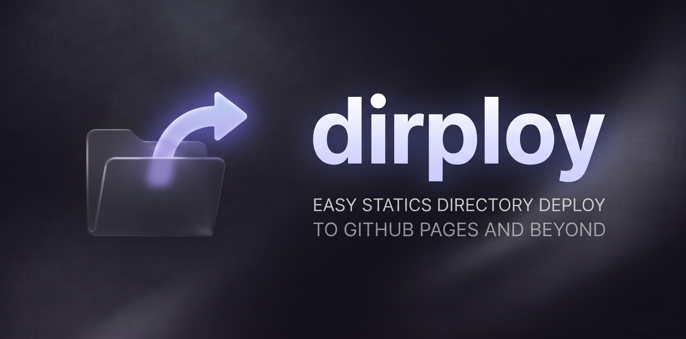

# Dirploy

Publish static builds from private repositories to isolated paths in your GitHub User Site.



Your source repository can stay private:

```text
my-project
    ↓
username.github.io/my-project
    ↓
https://username.github.io/my-project/
```

## Quick Start

Install as a development dependency:

```bash
npm install --save-dev dirploy
```

Publish `./dist` to your User Site:

```bash
npx dirploy ./dist
```

Publish to a specific subpath:

```bash
npx dirploy ./dist --path my-project
```

## How It Works

1. Automatically resolves your GitHub username (via GitHub CLI `gh auth status` or Git remote) and target repository (`username/username.github.io`).
2. Clones the target repository branch into an isolated temporary workspace.
3. Synchronizes only the specified destination subdirectory, removing stale files within that path while leaving all other hosted projects and root files completely untouched.
4. If files changed, commits and pushes cleanly back to GitHub.
5. Displays the published live URL.

## CLI Usage

```text
dirploy [source] [options]
dirploy init [options]
```

### Commands

* `init`: Creates a `dirploy.config.json` prefilled with inferred defaults for your repository.

### Options

```text
Arguments:
  source                     Static directory to publish (default: ./dist)

Options:
  -v, -V, --version          output the version number
  --path <path>              Destination directory inside the User Site repository
  --repo <owner/repository>  Destination repository (default: <owner>/<owner>.github.io)
  --branch <branch>          Destination branch (default: main)
  --message <message>        Git commit message (default: Deploy <path>)
  --local-repo <path>        Path to local clone of User Site repository for instant reference cloning
  --domain, --cname <domain> Custom domain for public site URL (auto-detected from CNAME if present)
  --exclude <patterns>       Comma-separated patterns to exclude from deployment (e.g. "*.map,.DS_Store")
  --no-clean                 Do not remove existing files in destination directory
  --nojekyll                 Create .nojekyll at repository root if missing
  --dry-run                  Calculate and display changes without committing or pushing
  --force                    Allow potentially destructive operations explicitly (e.g. overwrite in init)
  -h, --help                 Display help
```

## Configuration

You can optionally define project defaults in `dirploy.config.json` (or generate it with `npx dirploy init`):

```json
{
	"source": "dist",
	"path": "my-project",
	"localRepo": "../username.github.io",
	"domain": "myproject.com",
	"exclude": ["*.map", ".DS_Store"],
	"clean": true,
	"nojekyll": true
}
```

### Precedence

```text
CLI arguments → Configuration file → Defaults
```

## Authentication

### Local Development

Dirploy works out of the box with your existing authenticated Git environment:
* **SSH keys**: If your machine can push via SSH (`git@github.com:...`), Dirploy works automatically with zero setup.
* **HTTPS**: Standard Git credential helpers or environment tokens are automatically used.
* **GitHub CLI (`gh`)**: Supported optionally as a fallback, but **not required**.

Dirploy never handles or prompts for raw passwords, delegating authentication securely to Git.

### Continuous Integration (CI)

In GitHub Actions, authentication is handled via environment tokens:

* **Same repository**: Use the standard `GITHUB_TOKEN`:
  ```yaml
  - run: npx dirploy ./dist
    env:
      GITHUB_TOKEN: ${{ secrets.GITHUB_TOKEN }}
  ```
* **Different repository (e.g. publishing from `my-app` into `username.github.io`)**: Default `GITHUB_TOKEN` only has permissions for the current repository. Provide a Personal Access Token (Fine-grained token with `Contents: Read and write` on `username.github.io`) via `DIRPLOY_TOKEN`:
  ```yaml
  - run: npx dirploy ./dist
    env:
      DIRPLOY_TOKEN: ${{ secrets.DIRPLOY_TOKEN }}
  ```

Complete GitHub Actions workflow example:

```yaml
name: Deploy

on:
  push:
    branches:
      - main

permissions:
  contents: write

jobs:
  deploy:
    runs-on: ubuntu-latest
    steps:
      - uses: actions/checkout@v4
      - uses: actions/setup-node@v4
        with:
          node-version: 22
      - run: npm ci
      - run: npm run build
      - run: npx dirploy ./dist
        env:
          GITHUB_TOKEN: ${{ secrets.GITHUB_TOKEN }}
```

## Bundler Base URL Guide (Subpath Hosting)

Because Dirploy publishes your build to an isolated subpath (e.g. `https://<owner>.github.io/<subpath>/`), build artifacts referencing root-relative URLs (like `<script src="/assets/app.js">`) will result in 404 errors in the browser.

Dirploy automatically inspects your `index.html` and alerts you with a warning if absolute root paths are detected.

To configure your bundler for subpath hosting:

* **Vite**: Set `base: './'` in `vite.config.ts`:
  ```ts
  export default defineConfig({
    base: './',
  })
  ```
* **Astro**: Set `base` in `astro.config.mjs`:
  ```js
  export default defineConfig({
    base: '/<subpath>/',
  })
  ```
* **Next.js (Static Export)**: Set `basePath` in `next.config.js`:
  ```js
  module.exports = {
    output: 'export',
    basePath: '/<subpath>',
  }
  ```
* **Webpack**: Set `publicPath: './'` or `publicPath: '/<subpath>/'`.

## Safety Model

* **Subdirectory Isolation**: Deploying a project only modifies its assigned destination directory. All other projects and repository files remain untouched.
* **No Root Overwrites**: Deployments directly to the root (`.`) are rejected to prevent accidental overwriting of shared site infrastructure.
* **Path Traversal Protection**: Relative escapes (`../`) and absolute paths are strictly rejected.
* **No Force Push**: Dirploy never executes force pushes or history rewrites.
* **Dry Run Mode**: Preview changes safely with `--dry-run`.
* **Credential Protection**: Authentication tokens and secrets are never printed in logs or error messages.

## Programmatic API

```typescript
import { deploy } from 'dirploy'

const result = await deploy({
  sourceDirectory: './dist',
  repository: 'username/username.github.io',
  branch: 'main',
  destinationPath: 'my-project',
  commitMessage: 'Deploy my-project',
  dryRun: false,
})

console.log(result.url)
```

## Limitations

* Targets an existing GitHub User Site repository (`username.github.io`). You must create the repository on GitHub before your first deployment.
* Supports GitHub SSH and HTTPS remotes.

## Troubleshooting

* **Target repository does not exist**: Ensure your GitHub Pages User Site (`username.github.io`) is created and accessible.
* **Authentication failed**: Verify your GitHub CLI login status with `gh auth status` or check your Git SSH credentials.
* **Remote branch changed**: Another deployment completed while your deployment was in progress. Retry the deployment.

## License

MIT
